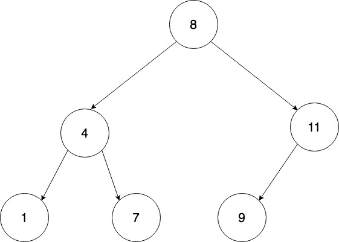
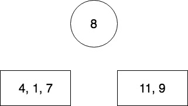
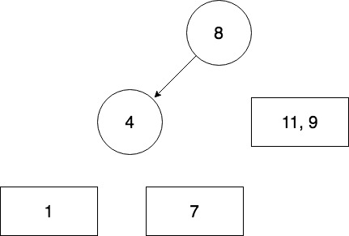
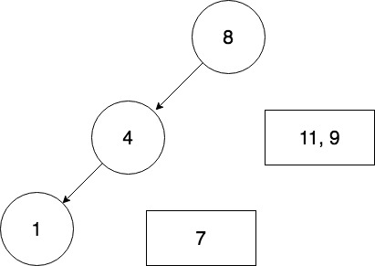
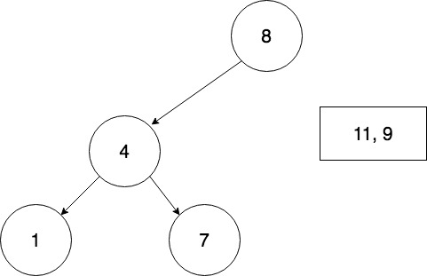

# HW17. Node's Distance in a Binary Search Tree.


**Please read the entire file before you ask any question.**

 In this assignment, you will have to find the distance of a node from the root node in a Binary Search Tree (BST). In order to achieve that, you need to complete two tasks. First, you need to create a BST with the given preorder traversal and then for a given number, you will find the distance of the node,from the root, with same value or report if such a node does not exist in the tree.

# Concepts
* BINARY SEARCH TREE: A binary search tree is a binary tree and satisfies the following conditions:
1. Each node has two links and one data attribute. This data attribute can be a primitive type (int, double, char, etc.) or an object.
2. The data attributes store values that must be distinct.
3. The data attributes must be totally ordered. If a and b are the values stored in two different nodes, then either a < b or a > b must be true. Transitivity must be satisfied (if a < b and b < c, then a < c).
4. For every node p in a tree, if p has a left child node q, then q -> value must be smaller than p -> value. Similarly, if p has a right child node r, then r -> value must be greater than p -> value.
5. Extending this, for any node p, every value in its left subtree must be less than p -> value and every value in its right subtree must be greater than p -> value.

* SEARCHING A BINARY SEARCH TREE: To find whether a given number is stored in a binary search tree, the search function compares the number with the value stored at the root. If the two values are the same, then we know that the value is stored in the tree. If the number is greater than the value stored at the root, then it is impossible to find the value on the left side of the tree. If the number is smaller than the value stored at the root, then it is impossible to find the value on the right side of the tree. This property is applied recursively until either (1) there is nothing to search or (2) it is found. This is precisely why a binary search tree is called a binary-search-tree: It is a tree that naturally supports searches.

* DISTANCE OF A NODE: The distance of a node is defined as the number of edges between the root and the node. The distance of the root node is 0.

* CREATING BST FROM PREORDER TRAVERSAL: In-order traversal cannot distinguish between different shapes of trees. In contrast, pre-order and post-order traversals do distinguish the different shapes. If we want to describe the shape of a tree,then in-order will not work. Pre-order and post-order traversals make this possible. It is best illustrated in the following figures:





**Fig 1: Example of a BST**


PRE ORDER TRAVERSAL: 8 4 1 7 11 9


IN ORDER TRAVERSAL:  1 4 7 8 9 11


PRE - ORDER TRAVERSAL OF A BST:   [ root | pre-order of left sub tree | pre-order to right subtree |]


PRE_ORDER TRAVERSAL OF EXAMPLE TREE:   [ 8 | pre-order of left sub tree | pre-order to right subtree |]

					[8 | 4 1 7 | 11 9]

CREATING BST FROM PRE-ORDER FOR THE ABOVE EXAMPLE:

* The first node is the root of the BST. Hence, 8 will be first inserted into the tree as the root.
* According to point 5 in the definition of a BST, all the elements less than the root , here 8, will be in the left subtree and all the elements greater than 8 will be in the right subtree. For the above example, [4 1 7] will be the left subtree and [11 9] will the right subtree of the root 8.
* Now we recursively insert elements first from the left subtree and then the right. 
* We call the function with our new array [4 1 7] since it is the left subtree.
* The first element 4 will be the root of this subtree and will be inserted first. All the elements less than 4 will be in left subtree and all the elements in greater than 4 in the right subtree. The left subtree of 4 is [1] and right is [7].
* With the recursive structure, the left subtree will now be the new array [1]. Since there is only one element, 1 will be inserted. 
* Now the algorithm backtracks to the previous stage: the right subtree of 4. Therefore the new array now is [7]. Since it is a single element, it will be inserted. 
* Similarly, the rest of the array will be inserted into the BST. 
You may find these steps illustrated here (circular node represented a node in the BST whereas the rectangular block suggests that those elements are still in the array waiting to be inserted into the tree.:

Step 1: 


Step 2: 


Step3: 


Step 4: 


Step 5: 


Step 6: 


# Learning Goals
* Learn about Binary Search Trees.
* Learn various traversals of a BST.
* Learn to search for a node in a BST.
* Learn to compute distance of a node from the root.
* Observe the uses of recursion.


# To Do
You would have to complete the following functions:

#### main()

This is the main function of your program.
It takes 1 arguments, which is the input file. If the number of arguments are not correct then return failure. After this you will begin creating a BST.
1. The input file has a list of numbers seprated by a newline. (every line has a new number). If there are 10 numbers, the first 9 are the nodes in the tree and the last number is the `search_query`. It is the number you have to search the tree and compute the distance for. Compute the number of lines in the input file. If there are `n` lines, then store the first `n-1` numbers in an array and the last one in an int variable. (In this assignment, we are considering only unique values as inputs for creating BST).
2. Create a BST with the input array. Use the function `CreateBST()`. It takes in four arguments, the array, the root of the tree, the start index of the tree and the end index of the tree.
3. Print the Inorder traversal of the BST using the function `BinaryTreeInOrderPrint()` which is already given to you.
4. Compute the distance of the `search_query` node from the root, which is given as input using the function `FindDistance()`. This function takes three inputs, the tree, the `search_query` and an initial distance = 0.
5. Print the value of distance computed using the function `PrintDistance()` which is already given to you.
6. Free all the memory used.
	
#### CreateBST(int *array, int root, int start, int end)

This function will create a Binary Search tree for the input array of preorder traversal of the tree. As described above, the first element of the array will be the root of the tree. Like in mergesort algorithm, you will be splitting the array into left and right child of a node using array indices: `start` and `end`. You will recursively call the function with the subarray of all the elements less than the root node as its left child and the sub array with all the elements greater than the root node as its right child. The first elements of the subarrays will be the roots of their respective sub trees. Recursively call this function until you find a leaf node. When a subarray has only one element, then that corresponds to a leaf node in a BST. Make sure you check for vioaltions of the indices, the start index can never exceed the value of end index. This function returns the root node.

#### FindDistance(treeNode\* t, int search_query, int distance)

Unlike linked lists and arrays, trees are not linear structures. Therefore, in order to traverse and search the tree, you will use recursion. In this function, you need to recursively compute the distance of a node by comparing the value at the node with the `search_query`. If the value is less than `search_query`, then search the left child of the node else, the right child. Either way, the node is not present at that level, hence you need to increment distance as you proceed. If the element is not present in the BST, return -1.

# Testing your code
Following are the files we provide:
1. `bst.c` - file which has `CreateBST()` and `FindDistance()` functions which you need to complete.
2. `bst.h` - header file which contains struct definition. Do not modify this file and do not submit this file.
3. `main.c` - main file for this assignment, you would have to implement `main` function in this.

# Functions given to you


**BinaryTreePrint(treeNode \* tn)**
This function prints the given tree in pre-order, in-order and post-order respectively. This function is given in case you want to understand the structure of the given Tree. You can determine the structure of the tree by using any of the two traversals

**BinaryTreePreOrderPrint(treeNode \* tn)**
This function prints the given tree in pre-order way. This function is only if you want to see the structure, you may/may not use this functions.

**BinaryTreeInOrderPrint(treeNode \* tn)**
This function prints the given tree in in-order way. This function is only if you want to see the structure, you may/may not use this functions.

**BinaryTreePostOrderPrint(treeNode \* tn)**
This function prints the given tree in pre-order way. This function is only if you want to see the structure, you may/may not use this functions.

**PrintDistance(int distance)**
This function prints the distance of the node in the required format.

#### Your Makefile should include

```
<your executable> inputs/test(x).txt > output(x).txt
diff output(x).txt expected/expected(x).txt
```

#### Flags to include
Please also include the following define flags for your Makefile.

```bash

-DTEST_MAIN  -DTEST_CREATEBST -DTEST_DIST -DTEST_PRINT

```

Type the following command to zip your file.
```bash
	zip hw17.zip bst.c main.c
```
**You will not get any credits if the submitted file is not zipped**

The **only** way to submit homework is through Blackboard.

If your program has any compilation error or warning (remember to use
`gcc -std=c99 -g -Wall -Wshadow --pedantic -Wvla -Werror`), you will
receive zero in this assignment.
