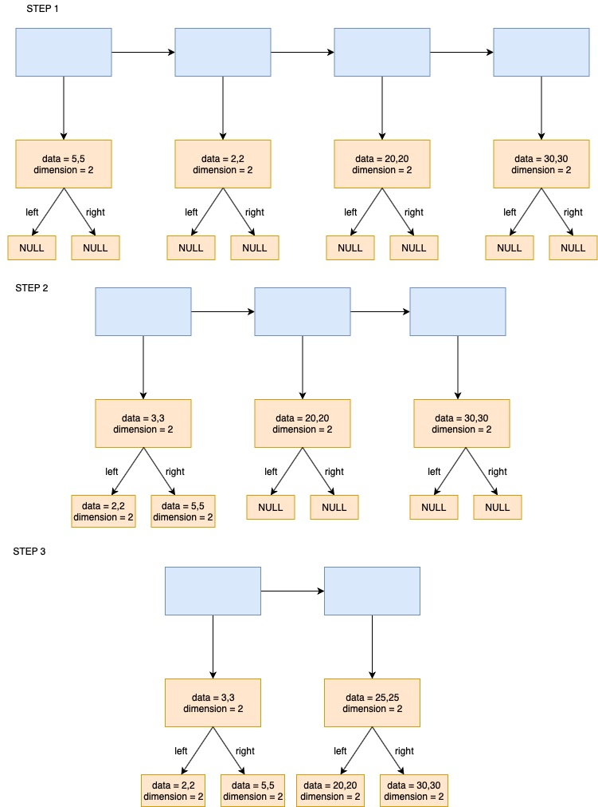
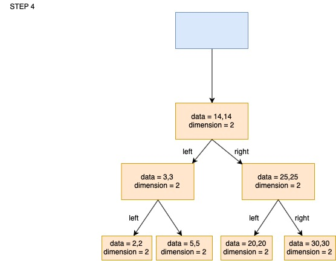

# HW19. Hierarchical Clustering (B)


**Please read the entire file before you ask any question.**

We will be performing the operation of hierarchical clustering in HW19.

## Learning Goals
* Learn to Use Dynamic Structures.

## What is Hierarchical Clustering?
* HW04 asked you to cluster data into `k` groups using the k-mean algorithm, where `k` is a number given to your program. However, we now implement a clusering algorithm that does not require us to select the value of `k` before hand.

#### Please read the handout with this assignment. Due to copyright, the handout is distributed in Blackboard. Page 395 of "An Introduction to Statistical Learning" by Gareth James, Daniela Witten, Trevor Hastie, Robert Tibshirani (published by Springer) explains the algorithm.


# To Do
* Your makefile will have 1 input to your code. (`argc` should be 2).
	* The input file.
	* Makefile example: `./hw18 inputs/test1.txt`
* The input data is available in the .txt files in the `inputs/` folder.

* **How will data be stored?**
	* For hierarchical clustering, we require a linked list.
	* Each node of the linked list contains a node of a tree. (Look at the structure definitions provided to you)
	
* **Requirements for HW19**
	* Initialize a Linked List.
	* First element of the file contains the number of of data points `n`. (Same as HW04 and HW18)
	* Second element of the file contains the dimension of of data points `dim`. (Same as HW04 and HW18)
	* Read the rest of elements from the input file, and store it in the `data` field of the structure `TreeNode`.
	* Popululate the entire Linked List.
	* Walk through the Linked List to find the two elements which have the smallest square of the [Euclidean distance](https://en.wikipedia.org/wiki/Euclidean_distance) between them. (Look at following example)
	* `Fuse` the two elements with the smallest distance between them.
		* This will involve creating a new ListNode whose data is equal to the average of data of the two nodes that are being fused. Please refer to `Centroid` based fusion in the handout.
		* The left and right children of the new node will be the two nodes that are being fused.
	* Print out the nodes that are being fused (in every iteration).
	
* **Examples**
### HOW TO READ THE DATA FROM THE INPUT FILES?
* If `n` = 3, `dim` = 2, Input File Contents are: 
	```
	1 2
	3 4
	5 6
	```
Then your datapoints should be: `(1,2)` `(3,4)` `(5,6)`
	
* If `n` = 2, `dim` = 3, Input File Contents are: 
	```
	1 2 3
	4 5 6
	```
Then your datapoints should be: `(1,2,3)` `(4,5,6)`

### WHAT DO WE MEAN BY MINIMUM DISTANCE?
* Find the square of the [Euclidean distance](https://en.wikipedia.org/wiki/Euclidean_distance) between each pair of datapoints.
	* if the points are `(1,2)` `(10,10)` `(2,3)`
	* the square of the distances between the pairs of nodes are shown below
	
|         | (1,2) | (10,10) | (2,3) |
|---------|-------|---------|-------|
| (1,2)   | -     | 145     | 2     |
| (10,10) | -     | -       | 113   |
| (2,3)   | -     | -       | -     |
	
	```
	The two elements with minimum separation would be: (1,2) and (2,3)
	
	```

# Working Example



#### The blue boxes correspond to the ListNodes. The orange boxes correspond to the TreeNodes. At each level the ListNodes with the minimum distance between them are removed, and a new node containing their `Centroid` is added.

# Functions to Complete
#### int main(int argc, char * * argv)
	* check for input errors. (incorrect `argc`)
	* declare file pointer.
	* read `n` and `dim` from the file.
	* call `LinkedListCreate`
	* call MakeCluster

#### void LinkedListCreate(ListNode * * head, int n, int dim, FILE* fptr)
	* `head` is the head of the Linked List
	* `n` is the number of datapoints.
	* `dim` is the dimension of each datapoint.
	* `fptr` is the file pointer declared in `main`.
	* read from file into an array.
	* use `CreateNode` to create new nodes for the Linked List.
	
#### ListNode* CreateNode(int n, int dim, int* arr)
	* `n` is the number of datapoints.
	* `dim` is the dimension of each datapoint.
	* `arr` is passed through LinkedListCreate.
	* initialize all the field of the ListNode, and return the appropriate value.
	* read from the file to populate the `data` field in `TreeNode`.
	
#### int FindDist(TreeNode* x, TreeNode* y)
	* find [Euclidean distance](https://en.wikipedia.org/wiki/Euclidean_distance) between two nodes' `data` fields.
	* return `int` value.
	
#### ListNode* Fuse(ListNode* head, ListNode* fuse1, ListNode* fuse2)
	* Create a new ListNode element using findCentroid function.
	* The new->treenode.data will hold the averaged values of the two parameters' data (fuse1, and fuse2)
	* add the new ListNode to the list.
	* remove the fuse1 and fuse2 from the list. (Do NOT free them from memory)
	* you may want to return head from this function (depending on your implementation)
	
#### ListNode* findCentroid(TreeNode* x, TreeNode* y)
	* Create a new node
	* Use a loop to average the data from the two parameters (x and y).
	
	```
		Average x->treenode.data[0] and y->treenode.data[0] to new->treenode.data[0]
		Average x->treenode.data[1] and y->treenode.data[1] to new->treenode.data[1]
		and so on
	```
	* The left child of the new Node will be x.
	* The right child of the new Node will be y.
	* Please ensure, the left child (x) is smaller than the right child(y)
		* `x -> treenode.data[0]` should be less than `y -> treenode.data[0]` 
		* if they are equal, `x -> treenode.data[1]` should be less than `y -> treenode.data[1]` 
	* Return the new node
	
#### void MakeCluster(ListNode** head)
	* Walk through the linked list.
	* Find pair of nodes with minimum distance between them.
	* Fuse the two nodes into one node.
	* Call print function
	* Continue till one node is remaining.
	
	
# Keep In Mind

* **In order to grade your assignments correctly, all the data that we would work with is going to be of type `int`. As seen in Step 2 of the illustration, the `Centroid` of `(2,2)` and `(5,5)` is `(3,3)`.**

* **Once you have found the elements with the least distance between them, (before you call the print function), ensure the value with the smaller treenode.data[0] is the first parameter. If treenode.data[0] is the same, then compare treenode.data[1], and so on.**

* **As seen in the illustration above, the left child of the treenode will always be `smaller` as compared to the right child.**

* **While computing the `Centroid` just compute the centroid between the roots of the sub-trees. For example, in Step 4 of the illustration above, only the roots of the sub-trees `(3,3)` and `(25,25)` are used to find the centroid `(14,14)`**

	


#### Flags to include
Please also include the following define flags for your Makefile.

```bash

-DTEST_MAIN -DTEST_CREATENODE -DTEST_LINKEDLISTCREATE -DTEST_DIST -DTEST_CENT -DTEST_FUSE -DTEST_CLUSTER

```

Type the following command to zip your file.
```bash
	zip hw19.zip hw19.c main.c
```
**You will not get any credits if the submitted file is not zipped**

The **only** way to submit homework is through Blackboard.

If your program has any compilation error or warning (remember to use
`gcc -std=c99 -g -Wall -Wshadow --pedantic -Wvla -Werror`), you will
receive zero in this assignment.
