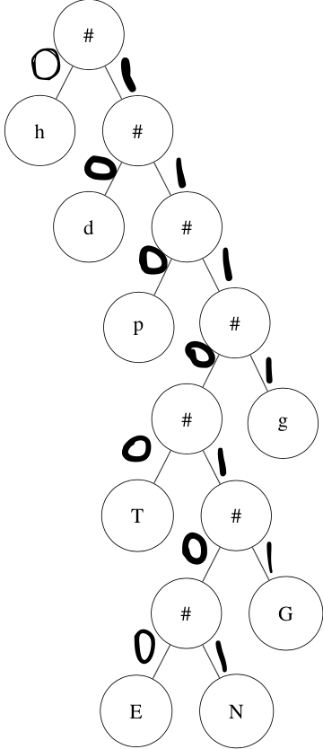

# HW21. Huffman Part 2

## Learning Goals
* Learn Huffman decoding
* Tree traversal to decode
**Please read the entire file before you ask any question.**

In the previous assignment, we learned to create the Huffman tree from the file header. In this assignment, we will learn to use that tree to decode the rest of the file.
As we learned from last assignment, Huffman is variable length coding. Which means that each character, instead of being stored as an 8 bit can be stored with any length of bits. It is also prefix coded, i.e.
no codeword is a prefix of another codeword.

From example in the last assignment, we generated the following Huffman tree from the file header :



 For this assignment, we consider that going to left node in Huffman means adding `0` to the code and going to right means adding `1` to the code. Let's again look at the binary file which is given as input :

 ```
   0000000: 10110100 01011001 00101110 00010101 01001010 00101101  
   0000006: 00111001 01000111 00101100 11100000 10110010 00000000  
   000000c: 00000000 00000000 00001010 11101001 11010111 10101111  
   0000012: 01111101 11110111 11011111 01111101 11110111 11001110  
   0000018: 01110011 10011100 11100111 00111111 11111111 11111111  
   000001e: 11111111 11111111 11111111 11111111 11111111 11111111  
   0000024: 11111111 01101101 10110110 11011011 01101101 10110110  
   000002a: 11011011 01101101 10110110 11010101 01010101 01010101  
   0000030: 01010101 01010101 01010101 01010101 01010101 01010101  
   0000036: 01010101 01010101 01010100 00000000 00000000 00000000  
   000003c: 00000000 00000000 00000000 00000000 00000000 00000000

 ```

 In last assignment, we read only the header, which is for this case is :

 ```
   0000000: 10110100 01011001 00101110 00010101 01001010 00101101  
   0000006: 00111001 01000111 00101100 11100000 10110010 00000000  
   000000c: 00000000 00000000
 ```

 The byte after header is `00001010` which represent `\n` that is newline character. Thus, the remaining binary file is:

 ```
   0000006:                            11101001 11010111 10101111  
   0000012: 01111101 11110111 11011111 01111101 11110111 11001110  
   0000018: 01110011 10011100 11100111 00111111 11111111 11111111  
   000001e: 11111111 11111111 11111111 11111111 11111111 11111111  
   0000024: 11111111 01101101 10110110 11011011 01101101 10110110  
   000002a: 11011011 01101101 10110110 11010101 01010101 01010101  
   0000030: 01010101 01010101 01010101 01010101 01010101 01010101  
   0000036: 01010101 01010101 01010100 00000000 00000000 00000000  
   000003c: 00000000 00000000 00000000 00000000 00000000 00000000

 ```

 We will read the file bit by bit and will traverse the Huffman tree to get the character. Note that all the character are leaf nodes, thus we will traverse the tree till we reach leaf node. For example: `11101001` is the first byte after header. The first bit in this is `1`, thus we move right from the tree, next bit is again `1` which mean right and we keep on traversing till we reach leaf node, which will appen after reading 7bits, we would have read the bits `1110100`, which represent value `E` in our tree. In similar fashion we will read the bits and decode the rest of the file.

 We will see the output will be
```
  ENNGGGGGGGGTTTTTTTgggggggggggggggggggpppppppppppppppppppppppd
  dddddddddddddddddddddddddddddddddddddddddddddhhhhhhhhhhhhhhh
  hhhhhhhhhhhhhhhhhhhhhhhhhhhhhhhhhhhhhhhhhhhhhhhhhhhhhhhhhh
```

# To Do
You would have to complete the following functions:

#### (decode.c): TreeNode * readHeader(FILE \* infptr)
This is the same function from the previous assignment.
This function takes input as file, reads the header as described above. This then creates a Huffman tree from the header, which will be used for decoding the file. As explained above in the decoding header, we will follow that logic.

#### (decode.c): int decode(char * infile, char * outfile) in decode.c
In this function, in addition to the last assignment, you will also decode the rest of the file.

For this assignment, `decode` function will 1st read the header by calling `readHeader` function. We will print the obtained Huffman tree in the output file by using `Tree_print` function given to you. It then will read the next four bytes (an unsigned int) store the number of characters in the article. This number is followed by a new line ’\n’ character. It also prints the number of characters obtained from header in the file to the output file using `PrintNumberChar` function.
Then we decode the rest the file as explained and will print each character in the `outfile`.

#### (list.c): ListNode \*  MergeListNode(ListNode \* head)
This function is same as in previous assignment.
This function takes the first two nodes from the LinkedList starting from head.Merges the tree from the nodes. Insert the new Node with the tree obtained from merging the two above nodes. This node should be inserted in such a way that this node becomes the head of the LinkedList.

Please note that when you merge the TreeNodes using Tree_merge function, it is important to maintain the order of passing TreeNode and which TreeNode becomes right child and which becomes left child. For this assignment, our compression algorithm takes TreeNode from the second ListNode of the passed LinkedList and makes it the left child of the new merged TreeNode. This function should maintain the same aforementioned order. Please read Huffman coding for understanding the functionality of this function.


# Functions given to you
1. `readBit(FILE * fptr, unsigned char * bit, unsigned char * whichbit, unsigned char * curbyte)` - This function reads a byte from file into curbyte. Then from curbyte it reads single bit and puts it into `bit`. `whichbit` keeps track of bit we are reading from curbyte.
2. `ListNode * ListNode_create(TreeNode * tn)` - Creates a single node of type ListNode pointer with values as the input tree  
4. `ListNode * List_insert(ListNode * head, ListNode * ln)` - insert the node `ln` into the LinkedList. This function is like a stack, as new head of the LinkedList is `ln` after this operation.
5. `void List_print(ListNode * head)` - prints the LinkedList from the head
6. `TreeNode * TreeNode_create(char val, int freq)` - creates a single node of type TreeNode ptr
7. `TreeNode * Tree_merge(TreeNode * becomesLeftChild, TreeNode * becomesRighChild)` - merges the two TreeNode \* for Huffman and gives back the merged TreeNode. Merged Node will have `tn1` as the left child, `tn2` as the right child.  Please read the Huffman coding to understand the Tree merge functionality.
8. `void Tree_print(TreeNode * tn, int level, FILE *outfptr)` - prints the given tree in post order format
9. `void Tree_destroy(TreeNode * tn)` - free the memory for the Tree
10. `void PrintNumberChar(unsigned int numChar, FILE * outfptr)` - prints the numchar into the output file


#### Your Makefile should include

```
./$(TARGET) input/input(x).bin output(x).txt
diff -i -w output(x).txt expected/expected(x).txt
```
#### Testgenerator:
For this assignment, we have further given you a testgenerator, which can be used to generate more compressed files using Huffman coding. It is in the folder `testgenerator`. To generate any new compressed file, you should run the following command :

```
  ./testgen <file you want to compress>.txt <output file>.bin
```
After you run this, you will see that it prints 2 things:
1. Huffman tree - where the space in front of the print values represent the depth of the node
2. Codebook that gets generated using the Huffman tree  

for example, if we use testgenerator for the input file mentioned above in example, we will get the following result. As you can see that the Tree printed after running testgenerator is same as the one shown above in figure.
Please Note that `input.txt` file is also in the testgenerator folder for your help.
```
$ ./testgen input.txt output.bin

    freq = 73 value = 104, 'h'
      freq = 46 value = 100, 'd'
          freq = 23 value = 112, 'p'
                  freq = 7 value = 84, 'T'
                          freq = 1 value = 69, 'E'
                          freq = 2 value = 78, 'N'
                      freq = 3
                      freq = 7 value = 71, 'G'
                  freq = 10
              freq = 17
              freq = 19 value = 103, 'g'
          freq = 36
        freq = 59
  freq = 105
freq = 178
h: 0
d: 1 0
p: 1 1 0
T: 1 1 1 0 0
E: 1 1 1 0 1 0 0
N: 1 1 1 0 1 0 1
G: 1 1 1 0 1 1
g: 1 1 1 1

```

#### Flags to include
Please also include the following define flags for your Makefile.

```bash

-DTEST_READHEADER -DTEST_DECODE -DTEST_MERGELIST -DDO_NOT_MODIFY

```

#### Files to submit
Type the following command to zip your file.

```bash
	zip hw20.zip decode.c list.c
```
**You will not get any credits if the submitted file is not zipped**

The **only** way to submit homework is through Blackboard.

If your program has any compilation error or warning (remember to use
`gcc -std=c99 -g -Wall -Wshadow --pedantic -Wvla -Werror`), you will
receive zero in this assignment.
